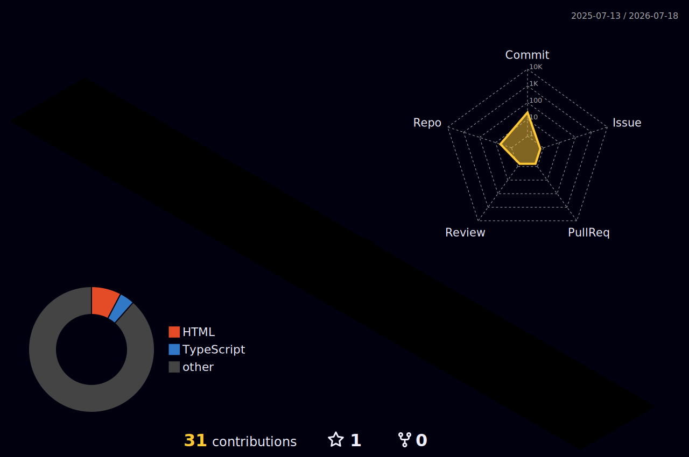

<!-- ============================================================
     TAUFIQ ALI — GITHUB PROFILE README
     100% GitHub-safe: no inline CSS (GitHub strips style="")
     Animated via SVG services + GitHub Actions (snake + 3D graph)
     ============================================================ -->

<!-- ==================== ANIMATED WAVE HERO ==================== -->
<div align="center">
  
</div>

<!-- ==================== TYPING ANIMATION ==================== -->
<div align="center">

  [](https://taufiqali.codes)

  <p>
    <a href="https://taufiqali.codes"></a>
    
    
  </p>

  <p>
    <a href="https://taufiqali.codes/#contact"></a>
  </p>

</div>

---

<!-- ==================== ABOUT ==================== -->
## 🧑‍💻 About Me

```typescript
const taufiq = {
  role:       "Full-Stack & AI Software Engineer",
  location:   "Dhaka, Bangladesh (GMT+6)",
  company:    "OrangeToolz.com",
  experience: "3 years building production systems",
  focus:      ["Voice AI Agents", "LLM Integrations", "Enterprise SaaS", "Real-time Systems"],
  currently:  "Shipping bidirectional voice AI with Gemini Live API (~620ms latency)",
  uptime:     "99.74% over 18 months in production",
} as const;
```

---

<!-- ==================== IMPACT METRICS ==================== -->
## 📊 Production Impact — Real Numbers

<div align="center">

| 💰 | 💬 | ⚙️ | 🎙️ |
|:---:|:---:|:---:|:---:|
| **$87K/mo** | **62K/day** | **8.4K/day** | **~620ms** |
| Stripe volume<br/><sub>TotalVoice Platform</sub> | WhatsApp messages<br/><sub>Peak volume</sub> | BullMQ jobs<br/><sub>P99 zero-loss</sub> | Voice AI latency<br/><sub>Gemini Live API</sub> |

| 👥 | 🏢 | 📈 | ⚡ |
|:---:|:---:|:---:|:---:|
| **340K+** | **840+** | **+38%** | **~720ms** |
| Contact records<br/><sub>Under management</sub> | Active businesses<br/><sub>Super Local Fans</sub> | Scan-to-redeem lift<br/><sub>QR Studio impact</sub> | P95 latency<br/><sub>Real-time CRM</sub> |


</div>

---

<!-- ==================== TECH STACK (skillicons — colorful, GitHub-safe) ==================== -->
## 🛠️ Tech Stack

### 🤖 AI & LLM
<p>
  
  
  
  
  
</p>

### ⚙️ Backend &nbsp;•&nbsp; 🎨 Frontend &nbsp;•&nbsp; ☁️ Cloud
<p>
  <a href="https://taufiqali.codes/#skills">
    
  </a>
</p>

<sub>**Specialties:** NestJS 11 modular architecture • BullMQ job queues • WebSocket audio streaming (AudioWorklet 16kHz) • React 19 • GraphQL • Stripe billing • WhatsApp Business API</sub>

---

<!-- ==================== FEATURED PROJECTS ==================== -->
## 🚀 Featured Projects

<table align="center">
  <tr>
    <td width="50%" valign="top">
      <h3 align="center">📞 TotalVoice Platform</h3>
      <p align="center">
        <a href="https://voicetotal.com"></a>
      </p>
      <p><b>Enterprise VoIP SaaS</b> — 22-module NestJS architecture powering a 12-role AI agent system.</p>
      <p>💰 <b>$87K/mo</b> Stripe volume &nbsp;•&nbsp; ⚙️ <b>8.4K/day</b> BullMQ jobs with P99 zero-loss</p>
      <p><sub><code>NestJS 11</code> <code>Prisma</code> <code>BullMQ</code> <code>Stripe</code> <code>Multi-LLM</code></sub></p>
    </td>
    <td width="50%" valign="top">
      <h3 align="center">💬 WhatsAppCRM</h3>
      <p align="center">
        <a href="https://wagend.com"></a>
      </p>
      <p><b>Real-time CRM at scale</b> — WhatsApp Business API with bulk contact management.</p>
      <p>💬 <b>62K/day</b> peak messages &nbsp;•&nbsp; 👥 <b>340K+</b> contacts &nbsp;•&nbsp; ⚡ <b>~720ms</b> P95</p>
      <p><sub><code>Node.js</code> <code>Redis</code> <code>WebSockets</code> <code>WhatsApp Business API</code></sub></p>
    </td>
  </tr>
  <tr>
    <td width="50%" valign="top">
      <h3 align="center">🎯 Super Local Fans</h3>
      <p align="center">
        <a href="https://superlocalfans.com"></a>
      </p>
      <p><b>QR Studio & PWA</b> — live branding previews with GraphQL sync.</p>
      <p>📈 <b>+38%</b> scan-to-redeem lift &nbsp;•&nbsp; 🏢 <b>840+</b> active businesses</p>
      <p><sub><code>React</code> <code>GraphQL</code> <code>PWA</code> <code>QR Generation</code></sub></p>
    </td>
    <td width="50%" valign="top">
      <h3 align="center">🤖 Voice AI Agent</h3>
      <p align="center">
        <a href="https://github.com/TAUFIQALI"></a>
      </p>
      <p><b>Gemini Live API</b> — bidirectional WebSocket audio streaming for real-time voice conversations.</p>
      <p>⚡ <b>~620ms</b> P50 latency &nbsp;•&nbsp; 🎙️ AudioWorklet 16kHz pipeline</p>
      <p><sub><code>Gemini Live</code> <code>WebSockets</code> <code>AudioWorklet</code> <code>TypeScript</code></sub></p>
    </td>
  </tr>
</table>

---

<!-- ==================== EXPERIENCE ==================== -->
## 💼 Experience

| | Role & Company | Highlights |
|:---:|---|---|
| 🏢 | **Full-Stack Developer & API Architect**<br/>TotalVoice Platform · *2024 — Present* | 22 NestJS modules • 12-role AI agent system • $87K/mo payment processing |
| 🚀 | **Full-Stack Developer**<br/>Agency Framework · *Jan 2024 — Present* | Redis-cached microservices • **99.74% uptime** over 18 months |
| 💬 | **Full-Stack Developer**<br/>WhatsAppCRM · *2023 — 2024* | 62K daily messages • ~720ms P95 latency • 340K+ contact records |
| 🎨 | **Frontend Developer**<br/>SalesPype & Pluto CRM · *2024* | React + Material UI component library • ~20% dev-time reduction |

---

<!-- ==================== LIVE GITHUB STATS (dynamic, no fake numbers) ==================== -->
## 📈 GitHub Analytics

<div align="center">
  
  
</div>

<div align="center">
  
</div>

<div align="center">
  
</div>

<!-- ==================== 3D CONTRIBUTION GRAPH (via GitHub Action) ==================== -->
<div align="center">
  <h3>🧊 3D Contribution Calendar</h3>
  
</div>

<!-- ==================== SNAKE ANIMATION (via GitHub Action) ==================== -->
<div align="center">
  <h3>🐍 Contribution Snake</h3>
  <picture>
    <source media="(prefers-color-scheme: dark)" srcset="https://raw.githubusercontent.com/TAUFIQALI/TAUFIQALI/output/github-snake-dark.svg" />
    <source media="(prefers-color-scheme: light)" srcset="https://raw.githubusercontent.com/TAUFIQALI/TAUFIQALI/output/github-snake.svg" />
    
  </picture>
</div>

---

<!-- ==================== INTERESTS ==================== -->
## 🎯 Beyond Code

<div align="center">

| ♟️ | 📚 | 📷 | 🎵 | ✈️ |
|:---:|:---:|:---:|:---:|:---:|
| **Chess**<br/><sub>Competitive online</sub> | **Reading**<br/><sub>Sci-fi • Tech</sub> | **Photography**<br/><sub>Street • Minimalism</sub> | **Music**<br/><sub>Ambient • Jazz</sub> | **Travel**<br/><sub>Exploring the world</sub> |

</div>

---

<!-- ==================== CONTACT ==================== -->
## 📫 Let's Connect

<div align="center">
  <a href="mailto:7taufiq7@gmail.com"></a>&nbsp;
  <a href="https://taufiqali.codes"></a>&nbsp;
  <a href="https://twitter.com/Taufiq_Ali"></a>&nbsp;
  <a href="https://github.com/TAUFIQALI"></a>
</div>

<br/>

<div align="center">
  
  
</div>

<!-- ==================== ANIMATED FOOTER ==================== -->
<div align="center">
  
</div>
